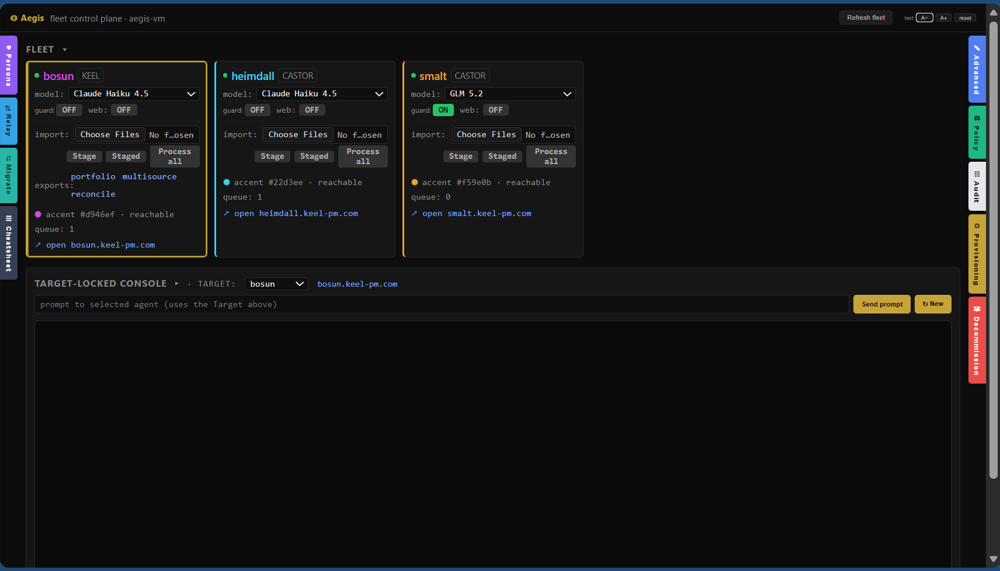

# Aegis

Aegis is the control plane for a small fleet of AI agents. It is one Node
process and one HTML page — no build step, no framework — that gives an
operator a single panel for every agent's health, model, guard rails, intake
queue, and lifecycle, and a bridge to the fleet's provisioning CLI so that the
heavyweight acts (provisioning, rebuilds, decommissions, policy changes) run
through the same attested, ledgered lanes whether they start from a browser or
a terminal.

The agents it commands are profiles of
[`marcusmayo/fleet`](https://github.com/marcusmayo/fleet):
[`keel`](https://github.com/marcusmayo/keel) (deterministic portfolio
reconciliation) and [`castor`](https://github.com/marcusmayo/castor) (research
intake). Aegis holds no agent data — it proxies, observes, and commands.

## What the panel does

- **Fleet cards** — live health, active model (switchable per agent from a
  dropdown backed by each agent's own routing table), web-access and
  protection toggles, processing-queue counts, and the agent's domain link.
  Click a card to target it.
- **Target-locked console** — prompt any one agent; the target is explicit and
  sticky, because "which agent did I just tell to do that" should never be a
  question.
- **Provisioning** — write a contract, preview the real plan (read-only
  what-if), seed the vault, then execute `up --go` behind a typed attestation,
  streamed live, with a concurrency cap read from policy. The panel never
  handles API keys except to pass them to the seeding child process — they are
  not logged, stored, or echoed.
- **Decommission** — the full teardown (registry, contract, resource group,
  Access app, service token, DNS, tunnel) behind its own typed phrase, also
  streamed.
- **Policy** — view and change structural caps (fleet size, batch, budget,
  regions) and per-agent protection through the attested ceremony, with a
  merged timeline of every attested act from both ledgers, refusals included.
- **Audit** — export any date range; agent chains are paged to the beginning
  and every record re-verified against its hash link. Older records that name
  things differently are normalized, because an audit document whose oldest
  rows are blank looks complete and isn't.
- **Relay** — operator-initiated, text-only message passing between explicitly
  granted agent pairs. Agents cannot open channels to each other.
- **Persona, intake, migration** — runtime persona editing per agent; per-card
  file import that stages (processing is always a separate operator act); and
  guided state moves between agents.
- **Update plane** — the plane's own code updates through the same shape it
  imposes on everything else: fast-forward only, attested, ledgered with
  before/after commits, and a red banner if the running process is older than
  its checkout.

A Telegram lane mirrors the essentials (`/use`, `/model`, `/web`, `/staged`,
prompts) for one allow-listed chat id, relaying each agent's own authoritative
responses rather than paraphrasing them.

## Architecture

- **`aegis.js`** — the whole server. Serves the panel, proxies authenticated
  calls to each agent through Cloudflare Access service tokens (one token per
  plane-agent pair, so an agent's audit chain records *which plane* commanded
  a thing), and spawns `fleetctl` from a fleet checkout for the heavy lanes.
- **`index.html`** — the whole client.
- **`telegram.js`** — the Telegram lane.
- **`aegis.config.json`** — the registry: agents, hosts, per-pair credentials,
  operator email. Written by `fleetctl up`/`enroll`, read here.
- **`aegis.policy.jsonc`** — structural caps, protected agents, the Telegram
  allowlist, relay pair grants. Changed only through the attested ceremony;
  every attempt is ledgered.

The fleet checkout is resolved from `FLEET_IAC_ROOT`, then the config, then a
`../fleet` sibling (with the historical sibling name as a fallback). Auth is
edge-only: the panel lives behind Cloudflare Access, and every agent call
carries a service token. There is no local-auth mode here on purpose — this
process commands cloud resources, and its front door stays locked.

## Running it

Hosted: `fleetctl aegis up` from the fleet repo provisions a VM whose
cloud-init clones both repos, wires the service, and self-registers — the
production path, documented in the fleet README.

Workstation: `node aegis.js` beside a fleet checkout, panel on
`http://127.0.0.1:7070`, bound to loopback. Same code, same ledgers; the two
planes keep separate registries by design, and `discover` reconciles them.

## The shape of the thing

Every consequential act in this repository has the same three properties: it
is **attested** (an exact typed sentence, per act, per name), it is
**ledgered** (append-only, hash-linked, refusals recorded alongside
successes), and it **fails loudly** (a control that half-applied says
`incomplete:` and exits non-zero; a plane running stale code wears a red
banner). The panel is deliberately boring JavaScript because the interesting
part is not the interface — it is that the interface cannot do anything the
audited lanes don't allow.
